<h3><code>mohamed@github ~ $ whoami</code></h3>
<table>
<tr>
<td valign="top"></td>
<td valign="top"></td>
</tr>
</table>

  

<h3><code>mohamed@github ~ $ ./contributions.sh</code></h3>

  

# Hey Everyone! I'm [Mohamed EL FARSSI](https://github.com/lfarssi)

  

  
 

<h4 align="center"><samp> Full Stack Developer | Passionate about Coding & Problem Solving | Constant Learner </samp></h4>

   

- 👨‍💻 <samp><b>Full Stack Developer with experience in React, Laravel, and Go</b></samp>
- 🎓 <samp><b>Self-motivated and detail-oriented programmer</b></samp>
- 🚀 <samp>Currently working on backend development and specialized scripting projects</samp>
- 🔍 <samp>Deepening knowledge in SpringBoot, Rust, and scalable architectures</samp>
- 💬 <samp>Ask me about Web Development, Database Management, and APIs</samp>
- 🛠️ <samp>Always building, learning, and contributing to open source</samp>
- 🎯 <samp>Goal: Keep growing, keep shipping robust code.</samp>

##

<h3><b><samp>Focus Areas:</samp></b></h3>

- 🏢 <b>Full Stack Web Development</b> 
&emsp;&emsp;Designing responsive frontends and secure, performant backends with Laravel and React.  

- 🏫 <b>System Scripting & Blockchain</b> 
&emsp;&emsp;Writing clean utilities, automated scripts, and exploring blockchain concepts.  

- 🧪 <b>Problem Solving</b> 
&emsp;&emsp;Algorithmic challenges on HackerRank and clean code practices.  

## 🛠️ Skills

### 🔤 Languages

### 🎨 Frontend

### 🖥️ Backend

### 🗄️ Databases

### ⚙️ Dev Tools & Environments

  
<h3><b><samp>Check out my Repositories</samp></b></h3>

[Check all my projects on GitHub](https://github.com/lfarssi)

  

### 🏆 GitHub Profile Trophies:

  

   
  

## 📈 GitHub Stats :

  
   
  
   
  

